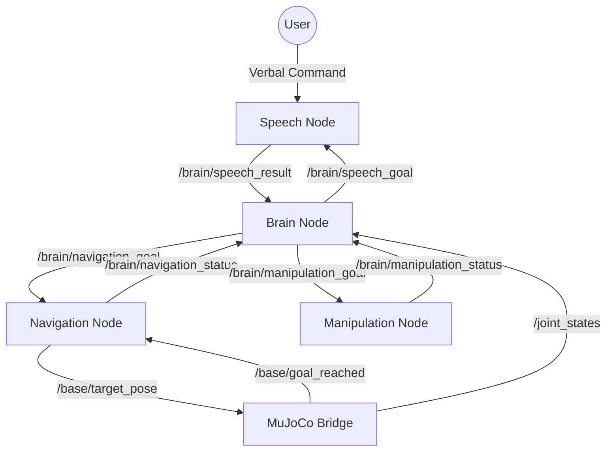

# TidyBot2 System Flow

This document details the high-level orchestration logic and communication protocols between the robot's nodes.

## Orchestration Overview
The **Brain Node** (`brain_node.py`) acts as the central orchestrator (master state machine). It manages the entire sequence of tasks and ensures that child nodes (Speech, Navigation, Manipulation) complete their goals before the system proceeds to the next step.

---

## Direct Communication Graph

---

## Orchestration State Machine

| State | Action by Brain Node | Waiting For | Node Responsible |
| :--- | :--- | :--- | :--- |
| **IDLE** | Check `/joint_states` | Simulation Start | MuJoCo Bridge |
| **WAITING** | Publish `listen` to `/brain/speech_goal` | - | Brain |
| **LISTENING** | - | Result on `/brain/speech_result` | Speech Node |
| **NAVIGATING** | Publish `find <item>` to `/brain/navigation_goal` | `arrived` on `/brain/navigation_status` | Navigation Node |
| **GRABBING** | Publish `grab` to `/brain/manipulation_goal` | `done` on `/brain/manipulation_status` | Manipulation Node |
| **RETURNING** | Publish `return_to_start` to `/brain/navigation_goal` | `arrived` on `/brain/navigation_status` | Navigation Node |
| **RELEASING** | Publish `release` to `/brain/manipulation_goal` | `done` on `/brain/manipulation_status` | Manipulation Node |
| **COMPLETED** | Log success & Reset | - | Brain |

---

## Detailed Communication Protocols

### Brain Node Interactions

#### 1. Speech Pipeline
- **Publishes**: `/brain/speech_goal` (String: `"listen"`)
- **Subscribes**: `/brain/speech_result` (String)
- **Wait Behavior**: Brain remains in `LISTENING` state until a non-empty string is received. If `"ERROR"` is returned, it retries with a 5s delay.

#### 2. Navigation Pipeline
- **Publishes**: `/brain/navigation_goal` (String: `"find <item>"`, `"return_to_start"`)
- **Subscribes**: `/brain/navigation_status` (String: `"idle"`, `"navigating"`, `"arrived"`, `"failed"`)
- **Wait Behavior**: Brain transitions to the next state ONLY when status is `"arrived"`.
- **Sync Note**: Navigation node drives to specific coordinates (e.g., `1.0, 1.0`) and waits for the simulation's `/base/goal_reached` topic before reporting arrival.

#### 3. Manipulation Pipeline
- **Publishes**: `/brain/manipulation_goal` (String: `"grab"`, `"release"`)
- **Subscribes**: `/brain/manipulation_status` (String: `"idle"`, `"executing"`, `"done"`, `"failed"`)
- **Wait Behavior**: Brain transitions to the next state ONLY when status is `"done"`.
- **Sequence Note**: The `grab` goal triggers a monolithic sequence: *Reach (IK) -> Grasp -> Retract*.

---

## System Timing & Safety
- **Settling Buffers**: The Brain Node inserts a **1.0s delay** after receiving any "complete" status (arrived/done) to ensure that physics have settled before issuing the next command.
- **Auto-Retry**: Speech failures trigger a **5.0s wait** before the robot attempts to listen again, ensuring a clean audio environment.
- **Heartbeat Check**: On startup, the Brain node requires active `/joint_states` messages to confirm the MuJoCo simulation is fully initialized.
