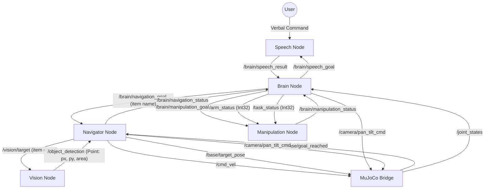

# TidyBot2 Task 1 System Flow

This document details the high-level orchestration logic and communication protocols between the robot's nodes for **Task 1: Object Retrieval**. The robot listens for a verbal command, finds and retrieves the named object, brings it back to the start position, and releases it.

## Orchestration Overview
The **Brain Node** (`brain_node.py`) acts as the central orchestrator. It publishes high-level goals to child nodes (Speech, Navigation, Manipulation) and waits for their status updates before advancing to the next state. It does **not** directly control the base or arms.

---

## Direct Communication Graph

---

## Orchestration State Machine

| State | Action by Brain Node | Waiting For | Node Responsible |
| :--- | :--- | :--- | :--- |
| **IDLE** | Monitor `/joint_states` + `/brain/command` | Sim ready + user command | MuJoCo Bridge |
| **WAITING_FOR_COMMAND** | Publish `"listen"` to `/brain/speech_goal` | - | Brain |
| **LISTENING** | - | String result on `/brain/speech_result` | Speech Node |
| **NAVIGATING** | Publish `<item>` to `/brain/navigation_goal` | `"arrived"` on `/brain/navigation_status` | Navigator Node |
| **GRABBING** | Publish `"grab"` to `/brain/manipulation_goal` | `"done"` on `/brain/manipulation_status` | Manipulation Node |
| **RETURNING** | Publish `"return_to_start"` to `/brain/navigation_goal` | `"arrived"` on `/brain/navigation_status` | Navigator Node |
| **RELEASING** | Publish `"release"` to `/brain/manipulation_goal` | `"done"` on `/brain/manipulation_status` | Manipulation Node |
| **COMPLETED** | Log success & auto-reset after 5s | - | Brain |

---

## Detailed Communication Protocols

### 1. Speech Pipeline
- **Brain publishes**: `/brain/speech_goal` (String: `"listen"`)
- **Brain subscribes**: `/brain/speech_result` (String: item name, e.g. `"banana"`)
- **Wait behavior**: Brain stays in `LISTENING` until a non-empty, non-`"ERROR"` string arrives. On `"ERROR"`, retries with a 5s delay. Times out and retries after 60s.
- **Data**: The raw result string becomes `target_item` and is passed directly to the Navigator as the navigation goal.

### 2. Navigation Pipeline
- **Brain publishes**: `/brain/navigation_goal` (String: `"<item>"` or `"return_to_start"`)
- **Brain subscribes**: `/brain/navigation_status` (String)
- **Wait behavior**: Brain transitions to next state only when `"arrived"` is received. On `"failed"`, transitions to `COMPLETED`.

#### Navigator Internal Sub-State Machine (for any item name goal)
The Navigator (`navigator.py`) manages the full approach sequence autonomously:

| Sub-State | Description |
| :--- | :--- |
| **SCANNING** | Spins base at `0.2 rad/s`. Publishes item name to `/vision/target`. Exits early to APPROACHING as soon as `/object_detection` has a fresh result. If full 360° completes with no detection → publishes `"failed"`. |
| **APPROACHING** | Visual servo loop at 10 Hz. Rotates base to keep object centered in frame (proportional control: `KP_ANGULAR * pixel_error_x`). Only drives forward once object is within `40px` of center. Scales forward speed proportionally down as object nears bottom of frame. If detection is lost → reverts to SCANNING. |
| **FINE_CENTERING** | Object has reached bottom of frame (`y > IMAGE_HEIGHT - 50px`). Base stops forward motion. Holds object centered in X within a `5px` deadzone for `0.5s` before advancing. |
| **CAMERA_RESET** | Tilts camera down (`-0.6 rad`) then up (`+0.6 rad`) via `/camera/pan_tilt_cmd`, with 1.2s dwell each phase. Repositions view for close-range arm operation. |
| **FINAL_APPROACH** | Pure odometry-based drive: moves forward `0.6m` at `0.1 m/s` (no YOLO). On completion → publishes `"arrived"`. |

#### Return to Start (`"return_to_start"` goal)
- Navigator resets camera to `[0.0, 0.0]` pan/tilt.
- Publishes `Pose2D(0.0, 0.0, 0.0)` to `/base/target_pose`.
- MuJoCo bridge drives to home and publishes `True` on `/base/goal_reached`.
- Navigator receives `goal_reached` → publishes `"arrived"`.

### 3. Manipulation Pipeline
- **Brain publishes**:
  - `/brain/manipulation_goal` (String: `"grab"` or `"release"`)
  - `/arm_status` (Int32: `1 = right arm`) — set once on startup
  - `/task_status` (Int32: `0 = task 1/2`) — set once on startup
- **Brain subscribes**: `/brain/manipulation_status` (String: `"idle"`, `"executing"`, `"done"`, `"failed"`)
- **Wait behavior**: Brain transitions on `"done"`. On `"failed"`, transitions to `COMPLETED`.
- **Grab sequence**: Reach (IK) → Grasp (close gripper) → Retract to stow pose.
- **Release sequence**: Open gripper → Retract.

---

## System Timing & Safety
- **Settling Buffers**: Brain inserts a **1.0s sleep** after receiving `"arrived"` from NAVIGATING, and after `"done"` from GRABBING, before issuing the next command.
- **Startup Delay**: Brain waits **5s** at launch for other nodes to initialize, then publishes `/arm_status` (`1`) and `/task_status` (`0`) and sets camera to `[0.0, 0.0]`.
- **Speech Retry**: On `"ERROR"` or JSON parse failure, Brain sleeps **5s** then re-enters `WAITING_FOR_COMMAND`. Hard timeout at **60s**.
- **Heartbeat**: Brain waits for at least one `/joint_states` message before leaving `IDLE`, confirming MuJoCo is fully running.
- **Detection Timeout**: Navigator considers a detection stale after **5s**. If detection goes stale during APPROACHING → reverts to SCANNING.
