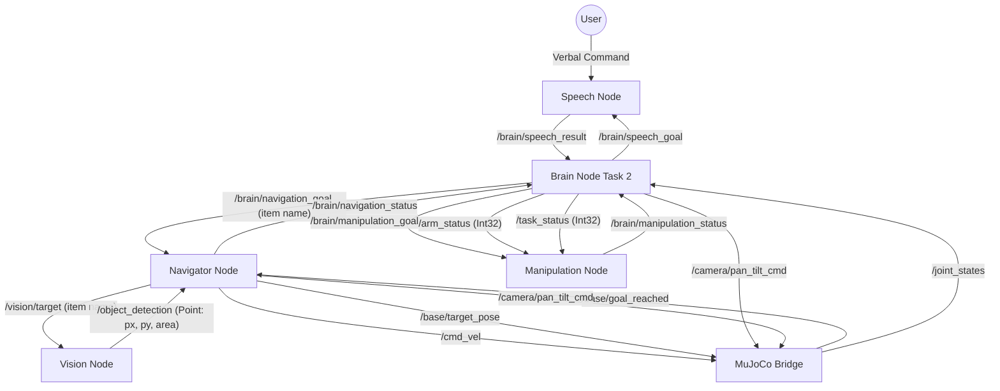

# TidyBot2 Task 2 System Flow

This document details the high-level orchestration logic and communication protocols for **Task 2: Sequential Task**. The robot listens for a verbal command describing a payload and a destination, finds and grabs the payload, navigates to the destination, deposits it, then returns home.

## Orchestration Overview
The **Task 2 Brain Node** (`brain_node_task2.py`) acts as the central orchestrator. It manages a dual-target sequence through the same Speech, Navigator, and Manipulation nodes used in Task 1. The Navigator's internal approach logic is **identical** to Task 1 — the Brain simply sends a different item name string for each leg.

---

## Direct Communication Graph

---

## Orchestration State Machine

| State | Action by Brain Node | Waiting For | Node Responsible |
| :--- | :--- | :--- | :--- |
| **IDLE** | Monitor `/joint_states` + `/brain/command` | Sim ready + user command | MuJoCo Bridge |
| **WAITING_FOR_COMMAND** | Publish `"listen_sequential"` to `/brain/speech_goal` | - | Brain |
| **LISTENING** | - | JSON result on `/brain/speech_result` | Speech Node |
| **NAV_TO_PAYLOAD** | Publish `<payload>` to `/brain/navigation_goal` | `"arrived"` on `/brain/navigation_status` | Navigator Node |
| **GRABBING** | Publish `"grab"` to `/brain/manipulation_goal` | `"done"` on `/brain/manipulation_status` | Manipulation Node |
| **NAV_TO_BIN** | Publish `<destination>` to `/brain/navigation_goal` | `"arrived"` on `/brain/navigation_status` | Navigator Node |
| **DEPOSITING** | Publish `"deposit"` to `/brain/manipulation_goal` | `"done"` on `/brain/manipulation_status` | Manipulation Node |
| **RETURNING** | Publish `"return_to_start"` to `/brain/navigation_goal` | `"arrived"` on `/brain/navigation_status` | Navigator Node |
| **COMPLETED** | Log success & auto-reset after 5s | - | Brain |

---

## Detailed Communication Protocols

### 1. Speech Pipeline (Sequential)
- **Brain publishes**: `/brain/speech_goal` (String: `"listen_sequential"`)
- **Brain subscribes**: `/brain/speech_result` (String: JSON, e.g. `{"payload": "banana", "destination": "bowl"}`)
- **Wait behavior**: Brain stays in `LISTENING` until valid JSON is received. On `"ERROR"` or malformed JSON, retries with a 5s delay. Hard timeout at 60s.
- **Data**: `payload` and `destination` are parsed and stored as internal variables for the full duration of the task.

### 2. Navigation Pipeline
- **Brain publishes**: `/brain/navigation_goal` (String: `"<payload>"`, `"<destination>"`, or `"return_to_start"`)
- **Brain subscribes**: `/brain/navigation_status` (String)
- **Wait behavior**: Brain transitions only when `"arrived"` is received. On `"failed"`, retries up to **3 times** before aborting.
- **Key point**: Both `<payload>` and `<destination>` are sent as raw item name strings (e.g. `"banana"`, `"bowl"`). The Navigator handles scanning and visual approach for **both** — there are no pre-programmed coordinates for either target.

#### Navigator Internal Sub-State Machine (identical for both navigation legs)
| Sub-State | Description |
| :--- | :--- |
| **SCANNING** | Spins base at `0.2 rad/s`. Publishes item name to `/vision/target`. Exits early to APPROACHING as soon as `/object_detection` has a fresh result. Full 360° with no detection → publishes `"failed"`. |
| **APPROACHING** | Visual servo loop at 10 Hz. Pure rotation until within `40px` of center, then drives forward proportionally. Speed scales down as object nears bottom of frame. Lost detection → reverts to SCANNING. |
| **FINE_CENTERING** | Object at bottom of frame (`y > IMAGE_HEIGHT - 50px`). Holds object centered in X within `5px` deadzone for `0.5s`. |
| **CAMERA_RESET** | Tilts camera down (`-0.6 rad`) then up (`+0.6 rad`) via `/camera/pan_tilt_cmd`, `1.2s` dwell each. |
| **FINAL_APPROACH** | Odometry-based forward drive of `0.6m` at `0.1 m/s`. On completion → publishes `"arrived"`. |

#### Return to Start (`"return_to_start"` goal)
- Navigator resets camera to `[0.0, 0.0]` pan/tilt.
- Publishes `Pose2D(0.0, 0.0, 0.0)` to `/base/target_pose`.
- MuJoCo bridge drives home and publishes `True` on `/base/goal_reached`.
- Navigator receives `goal_reached` → publishes `"arrived"`.

### 3. Manipulation Pipeline
- **Brain publishes**:
  - `/brain/manipulation_goal` (String: `"grab"` or `"deposit"`)
  - `/arm_status` (Int32: `1 = right arm`) — set once on startup
  - `/task_status` (Int32: `0 = task 1/2`) — set once on startup
- **Brain subscribes**: `/brain/manipulation_status` (String: `"idle"`, `"executing"`, `"done"`, `"failed"`)
- **Wait behavior**: Brain transitions on `"done"`. On `"failed"` during deposit, Brain still transitions to `RETURNING`.
- **Grab sequence**: Reach (IK) → Grasp (close gripper) → Retract to stow pose.
- **Deposit sequence**: Lift → Align with bin → Release (open gripper) → Retract.

---

## System Timing & Safety
- **Settling Buffers**:
  - **1.0s sleep** after `"arrived"` from `NAV_TO_PAYLOAD`, before issuing `"grab"`.
  - **1.5s sleep** after `"arrived"` from `NAV_TO_BIN`, before issuing `"deposit"` (longer to allow base oscillations to settle for accuracy).
  - **1.0s sleep** after deposit `"done"`, before issuing `"return_to_start"`.
- **Startup Delay**: Brain waits **5s** at launch, then publishes `/arm_status` (`1`) and `/task_status` (`0`) and sets camera to `[0.0, 0.0]`.
- **Speech Retry**: On `"ERROR"` or parse failure, Brain sleeps **5s** then re-enters `WAITING_FOR_COMMAND`. Hard timeout at **60s**.
- **Navigation Retry**: Up to **3 retries** on `"failed"` for each navigation leg. After max retries on `NAV_TO_BIN`, Brain forces a `DEPOSITING` transition anyway to avoid permanently blocking.
- **Heartbeat**: Brain waits for at least one `/joint_states` message before leaving `IDLE`.
- **Detection Timeout**: Navigator considers detection stale after **5s**; stale during approach → reverts to SCANNING.
