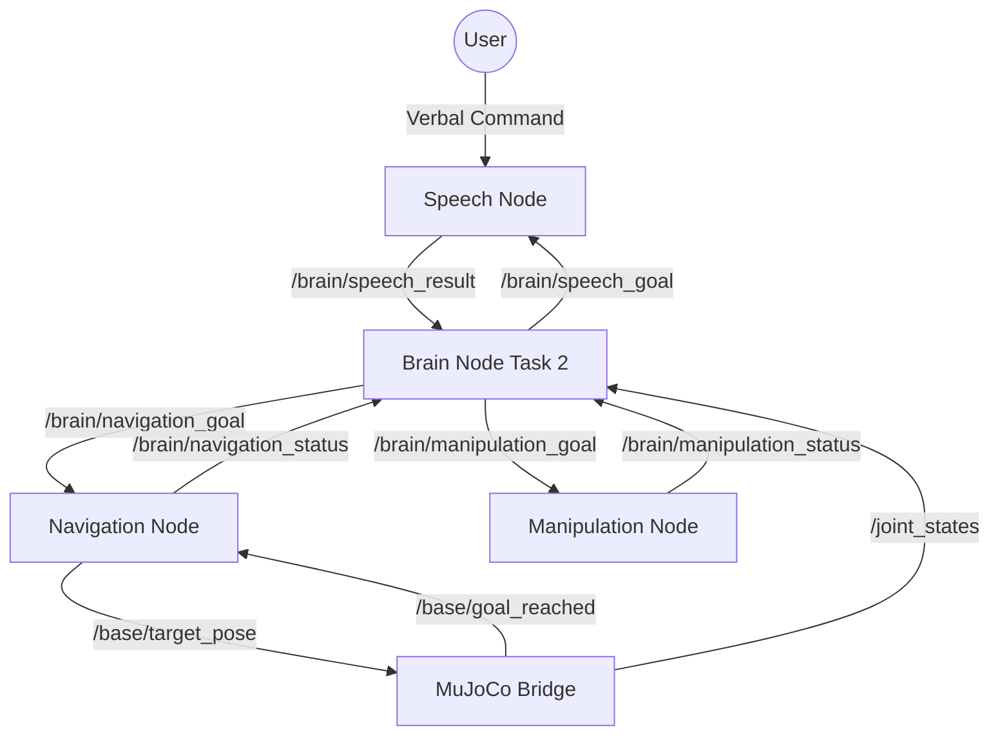

# TidyBot2 Task 2 System Flow

This document details the high-level orchestration logic and communication protocols for **Task 2: Sequential Task**. In this task, the robot retrieves a payload and delivers it to a specific destination bin/location.

## Orchestration Overview
The **Task 2 Brain Node** (`brain_node_task2.py`) acts as the central orchestrator. It manages a dual-target sequence, ensuring the Speech, Navigation, and Manipulation nodes coordinate to move an object from point A to point B before returning home.

---

## Direct Communication Graph

---

## Orchestration State Machine

| State | Action by Brain Node | Waiting For | Node Responsible |
| :--- | :--- | :--- | :--- |
| **IDLE** | Check `/joint_states` | Simulation Start | MuJoCo Bridge |
| **WAITING** | Publish `listen_sequential` to `/brain/speech_goal` | - | Brain |
| **LISTENING** | - | JSON Result on `/brain/speech_result` | Speech Node |
| **NAV_TO_PAYLOAD** | Publish `<payload>` to `/brain/navigation_goal` | `arrived` on `/brain/navigation_status` | Navigation Node |
| **GRABBING** | Publish `grab` to `/brain/manipulation_goal` | `done` on `/brain/manipulation_status` | Manipulation Node |
| **NAV_TO_BIN** | Publish `<destination>` to `/brain/navigation_goal` | `arrived` on `/brain/navigation_status` | Navigation Node |
| **DEPOSITING** | Publish `deposit` to `/brain/manipulation_goal` | `done` on `/brain/manipulation_status` | Manipulation Node |
| **RETURNING** | Publish `return_to_start` to `/brain/navigation_goal` | `arrived` on `/brain/navigation_status` | Navigation Node |
| **COMPLETED** | Log success & Reset | - | Brain |

---

## Detailed Communication Protocols

### Brain Node Interactions

#### 1. Speech Pipeline (Sequential)
- **Publishes**: `/brain/speech_goal` (String: `"listen_sequential"`)
- **Subscribes**: `/brain/speech_result` (String: JSON `{"payload": "apple", "destination": "basket"}`)
- **Wait Behavior**: Brain remains in `LISTENING` state until valid JSON is received. If `"ERROR"` is returned or JSON is malformed, it retries with a 5s delay.
- **Data Persistence**: Once parsed, the `payload` and `destination` are stored as internal state variables for the duration of the task.

#### 2. Navigation Pipeline
- **Publishes**: `/brain/navigation_goal` (String: `"<item>"`, `"return_to_start"`)
- **Subscribes**: `/brain/navigation_status` (String: `"idle"`, `"navigating"`, `"arrived"`, `"failed"`)
- **Wait Behavior**: Brain transitions to the next state ONLY when status is `"arrived"`.
- **Target Switching**: The Brain Node manages the handoff from the payload target to the destination target once the `GRABBING` phase is complete.

#### 3. Manipulation Pipeline
- **Publishes**: `/brain/manipulation_goal` (String: `"grab"`, `"deposit"`)
- **Subscribes**: `/brain/manipulation_status` (String: `"idle"`, `"executing"`, `"done"`, `"failed"`)
- **Wait Behavior**: Brain transitions to the next state ONLY when status is `"done"`.
- **Deposit Logic**: The `deposit` command triggers a specific sequence: *Vertical lift -> Align with bin -> Release -> Retract*.

---

## System Timing & Safety
- **Settling Buffers**: The Brain Node inserts a **1.5s delay** after `NAV_TO_BIN` to ensure the mobile base has fully settled and target oscillations have ceased before attempting the `deposit`.
- **Auto-Retry**: Speech extraction failures trigger a **5.0s wait** before the next `listen_sequential` attempt.
- **Fail-Safe**: If `arrived` is never reached during navigation, the brain allows up to 3 retries (re-scanning) before returning to `IDLE`.
- **Heartbeat Check**: The node continuously monitors `/joint_states` at 10Hz; if data stops, it enters a `PAUSED` state to prevent command buildup.
