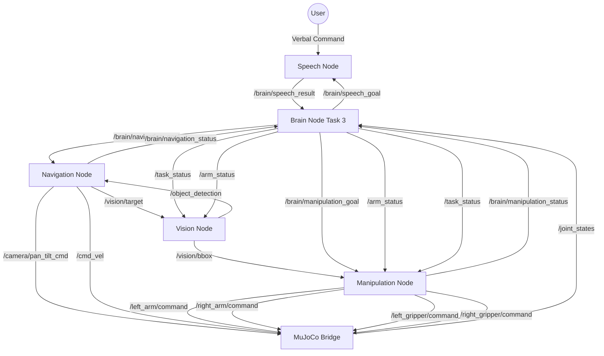

# TidyBot2 Task 3 System Flow

This document details the high-level orchestration logic and communication protocols for **Task 3: Liquid Pouring**. The robot navigates to a bottle assembly, uses the Vision/Segmentation Node to locate individual parts, then coordinates both arms in sequence — left arm grabs the body (yellow cube) first, then right arm grabs and untwists the lid (red cube) and pours in place.

## Orchestration Overview
The **Task 3 Brain Node** acts as the central orchestrator. It manages a single-navigation sequence: speech parsing → navigate to bottle → [trigger segmentation for body] → left arm grabs body → [trigger segmentation for lid] → right arm grabs lid, untwists, and pours in place.

---

## Direct Communication Graph

---

## Orchestration State Machine

| State | Action by Brain Node | Waiting For | Node Responsible |
| :--- | :--- | :--- | :--- |
| **IDLE** | Check `/joint_states` | Simulation Start | MuJoCo Bridge |
| **WAITING** | Publish `listen` to `/brain/speech_goal` | — | Brain |  
| **LISTENING** | — | JSON Result on `/brain/speech_result` | Speech Node |
| **NAV_TO_BOTTLE** | Publish `<source>` to `/brain/navigation_goal` | `arrived` on `/brain/navigation_status` | Navigation Node |
| **SEGMENT_BODY** | Publish `0` to `/arm_status`, `1` to `/task_status` | Bbox on `/vision/bbox` (received by Manipulation Node) | Vision/Segmentation Node |
| **GRAB_BODY** | Publish `grab` to `/brain/manipulation_goal` | `done` on `/brain/manipulation_status` | Manipulation Node |
| **SEGMENT_LID** | Publish `1` to `/arm_status`, `1` to `/task_status` | Bbox on `/vision/bbox` (received by Manipulation Node) | Vision/Segmentation Node |
| **GRAB_LID_UNTWIST_POUR** | Publish `grab` to `/brain/manipulation_goal` | `done` on `/brain/manipulation_status` | Manipulation Node |
| **COMPLETED** | Log success & Reset | — | Brain |

---

## Navigation Sub-State Machine (Internal to Navigation Node)

The Brain sends the item name and waits for `"arrived"`. The Navigation Node handles everything internally:

| Sub-State | Behavior |
| :--- | :--- |
| **SCANNING** | Base spins in place up to 360°. Vision Node runs YOLO continuously via `/object_detection`. Stops early if the target is detected; reports `"failed"` if full rotation completes with no detection. |
| **APPROACHING** | Visual servo: rotate until object is centred in frame, then drive forward while correcting heading. Forward speed scales down as object rises toward the bottom of the frame. |
| **FINE_CENTERING** | When object Y-pixel exceeds the bottom-of-frame threshold the base halts. Holds precise X-centring for a short settling duration. |
| **CAMERA_RESET** | Camera tilts down then back up to reposition the view for close-range arm operation. |
| **FINAL_APPROACH** | Odometry-only straight drive forward a fixed distance at slow speed. Publishes `"arrived"` when complete. |

---

## Detailed Communication Protocols

### 1. Speech Pipeline
- **Publishes**: `/brain/speech_goal` (String: `"listen"`)
- **Subscribes**: `/brain/speech_result` (String: JSON `{"source": "bottle"}`)
- **Wait Behavior**: Brain remains in `LISTENING` until valid JSON is received. `"ERROR"` or malformed JSON triggers a retry with a short delay.

### 2. Navigation Pipeline
- **Publishes**: `/brain/navigation_goal` (String: source item name from speech result)
- **Subscribes**: `/brain/navigation_status` (String: `"arrived"`, `"failed"`)
- **Wait Behavior**: Brain only advances on `"arrived"`. On `"failed"`, retries before returning to `IDLE`.

### 3. Vision Segmentation Pipeline
- **Trigger**: Brain publishes `1` to `/task_status` and the appropriate value to `/arm_status` to signal the Segmentation Node which object to find.
- **Behavior**:
  - `0` on `/arm_status` → Segmentation Node segments the **red cubes** (body) from the current camera frame and publishes its bounding box to `/vision/bbox`.
  - `1` on `/arm_status` → Segmentation Node segments the **yellow cube** (lid) and publishes its bounding box to `/vision/bbox`.
- **Manipulation Node**: Subscribes to `/vision/bbox` **directly**. As soon as a bbox arrives, the Manipulation Node stores it, ready for the next `grab` goal.
- **Brain Wait Behavior**: Brain remains in `SEGMENT_*` state until it has published the correct `arm_status`, then immediately proceeds to publish `grab`. (The Manipulation Node is responsible for having the latest bbox before executing.)

### 4. Manipulation Pipeline
- **Publishes**:
  - `/brain/manipulation_goal` (String: `"grab"`) — same goal string for both grabs
  - `/arm_status` (Int32: `0=left`, `1=right`) — updated before each goal, also read by Segmentation Node
  - `/task_status` (Int32: **`1`** for Task 3) — also read by Segmentation Node
- **Subscribes**: `/brain/manipulation_status` (String: `"idle"`, `"executing"`, `"done"`, `"failed"`)
- **Wait Behavior**: Brain advances ONLY on `"done"`.

---

## Manipulation Goal Details

### First `grab` — Left Arm Grabs Body
- Triggered by `0` on `/arm_status`, `1` on `/task_status`.
- Manipulation Node uses the latest bbox of the **yellow cube** (received from `/vision/bbox`) to compute the grasp target.
- Left arm reaches to yellow cube position (IK from bbox + depth) and grasps the body.
- Reports `"done"` → Brain transitions to `SEGMENT_LID`.

### Second `grab` — Right Arm Grabs Lid, Untwists, Pours
- Triggered by `1` on `/arm_status`, `1` on `/task_status`.
- Manipulation Node uses the latest bbox of the **red cube** (received from `/vision/bbox`) to compute the grasp target.
- Right arm reaches to red cube position (IK from bbox + depth) and grasps the lid.
- Executes an **untwist** wrist-rotation sequence in place (left arm stabilises the body).
- Tilts to pour angle and holds for a fixed pour duration — no navigation to a bowl required; pours in place.
- Arm retracts after pour completes.
- Reports `"done"` → Brain transitions to `COMPLETED`.

---

## Key Differences vs. Tasks 1 & 2

| Aspect | Task 1 | Task 2 | Task 3 |
| :--- | :--- | :--- | :--- |
| `task_status` | `0` | `0` | **`1`** |
| Navigation legs | 2 (object + return) | 3 (payload + bin + return) | 1 (bottle only, no return) |
| Manipulation goals | `grab`, `release` | `grab`, `deposit` | `grab` × 2 (behaviour determined by `arm_status` + `task_status`) |
| Object localisation | AprilTag / YOLO+depth | AprilTag / YOLO+depth | Segmentation Node colour segmentation → bbox direct to Manip Node |
| Bimanual use | No | No | Yes (left=body first, right=lid+pour) |
| Second navigation leg | Yes (return) | Yes (bin + return) | No — pour happens in place |
| Vision segmentation role | Navigation only | Navigation only | Navigation + object targeting for both arms |
